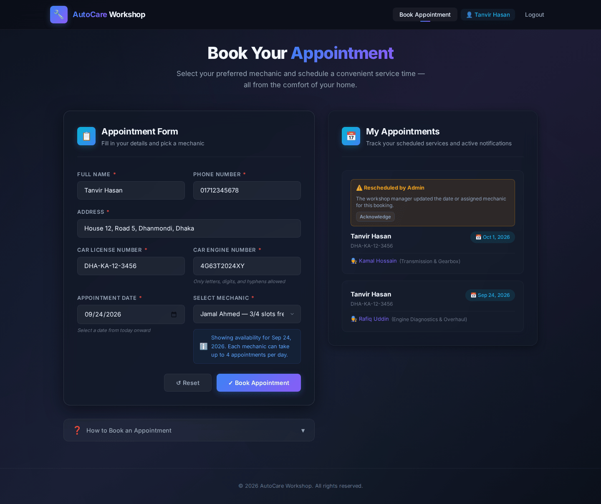
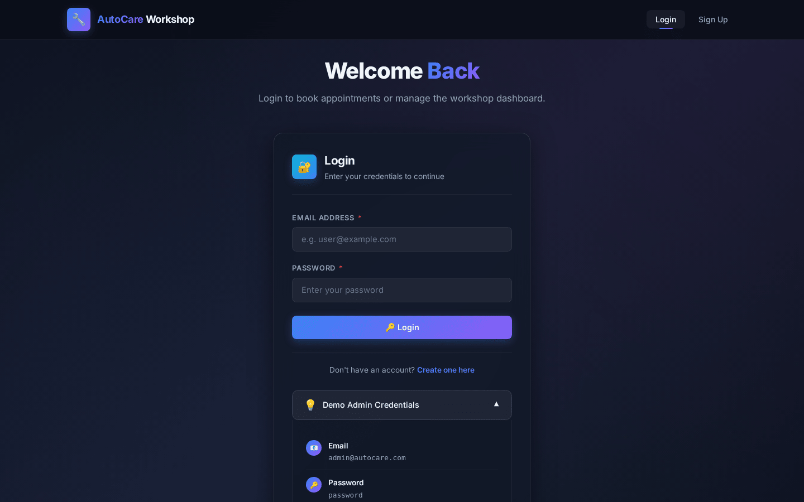
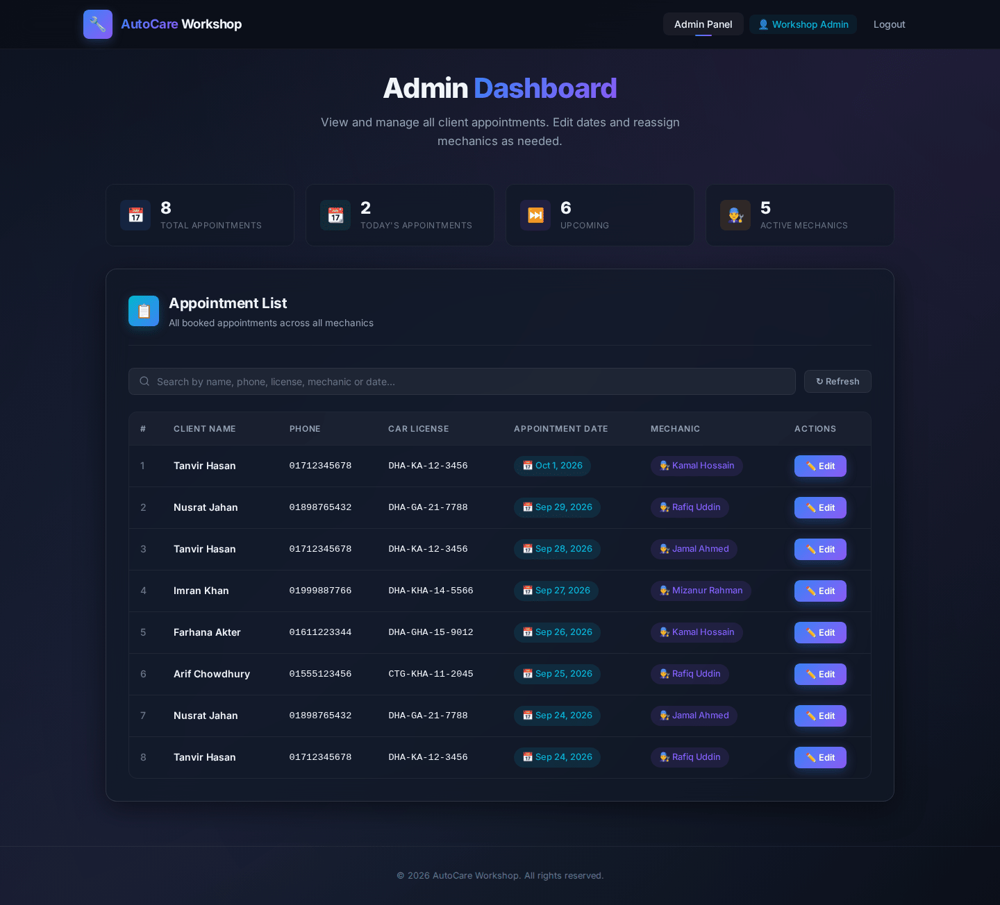
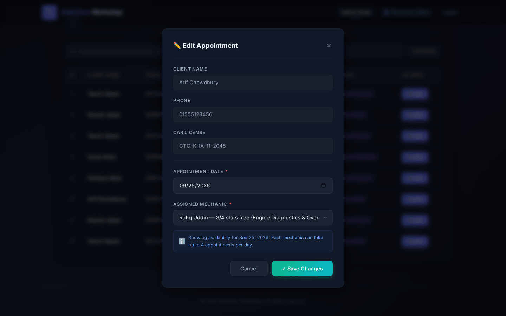
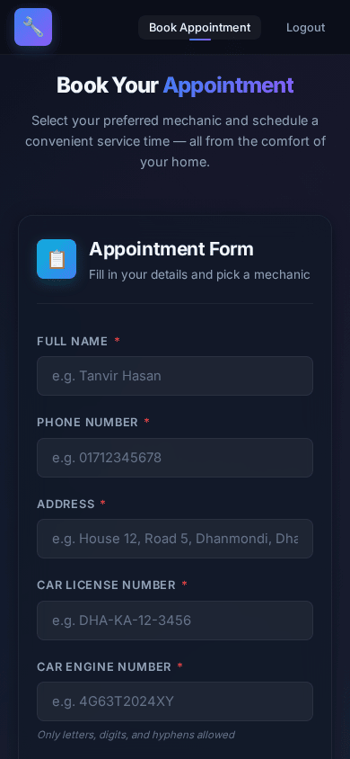

# 🔧 AutoCare Workshop

An online appointment system for a car workshop. Clients sign up, pick a date and a mechanic, and book a service slot. The workshop admin sees every booking and can reschedule or reassign it.

Built with plain PHP, MySQL, and vanilla JavaScript (no frameworks) as a university web development project.

> **Demo admin login** (created by `db.sql`): `admin@autocare.com` / `password`. You can also sign up as a new client.



## Features

**Clients**
- Sign up and log in (bcrypt-hashed passwords, PHP sessions)
- Book an appointment with personal and car details, a date, and a mechanic
- See live availability: each mechanic's free slots update when you pick a date, and fully booked mechanics can't be selected
- Form validation in the browser and again on the server
- "My Appointments" panel, with a notice when the workshop reschedules one of your bookings

**Admin**
- Dashboard stats: total, today's, and upcoming appointments, plus the number of mechanics
- Searchable list of every appointment (by name, phone, license, mechanic, or date)
- Change an appointment's date or mechanic, with availability checked again before saving

**Booking rules**
- A mechanic takes at most **4 cars per day** (set by `MAX_APPOINTMENTS_PER_DAY`)
- A client can have only **one appointment per day** (also enforced by a unique key in the database)
- Appointments can't be booked in the past or moved into the past
- Bookings run inside a transaction that locks the mechanic's row, so two clients can't grab the same last slot at once

## Screenshots

| Login | Admin dashboard |
|---|---|
|  |  |
| **Rescheduling an appointment** | **Mobile view** |
|  |  |

## Tech Stack

| Layer | Technology |
|---|---|
| Frontend | HTML5, CSS3 (custom design, responsive), vanilla JavaScript (Fetch API) |
| Backend | PHP 7.4+ with PDO, JSON API |
| Database | MySQL / MariaDB (InnoDB) |

## Getting Started

### Option A: XAMPP
1. Clone or copy this folder into `xampp/htdocs/`.
2. Start **Apache** and **MySQL** from the XAMPP Control Panel.
3. Open phpMyAdmin (`http://localhost/phpmyadmin`) and import `db.sql`. It creates the `car_workshop` database, the tables, and the seed data.
4. Visit `http://localhost/autocare_carworkshop/`.

### Option B: PHP's built-in server
```bash
mysql -u root -p < db.sql
php -S localhost:8000
```
Then open http://localhost:8000.

### Database credentials
By default the app connects as `root` with no password (the XAMPP default). To use different credentials, copy `config.local.example.php` to `config.local.php` and edit it. That file is git-ignored, so your credentials never get committed.

## Project Structure

```
├── index.html            # Client booking page
├── admin.html            # Admin dashboard
├── login.html / signup.html
├── css/style.css
├── js/
│   ├── common.js         # Shared helpers: API calls, toasts, dates, validation UI
│   ├── auth-guard.js     # Redirects by login state and role
│   ├── app.js            # Booking form + "My Appointments"
│   ├── admin.js          # Dashboard, search, edit modal
│   ├── login.js
│   └── signup.js
├── api/
│   ├── bootstrap.php     # Session, DB connection, JSON + auth helpers
│   ├── auth.php          # signup / login / logout / check
│   ├── mechanics.php     # Mechanics with free slots for a date
│   ├── appointments.php  # Client: list + book + dismiss notices
│   └── admin.php         # Admin: list + reschedule
├── config.php            # Settings (overridable via config.local.php)
└── db.sql                # Schema + seed data
```

## API Reference

All endpoints return JSON shaped like `{ success, message?, data? }`.

| Method | Endpoint | Access | Description |
|---|---|---|---|
| `POST` | `api/auth.php` | Public | `action`: `signup`, `login`, `logout`, or `check` |
| `GET` | `api/mechanics.php?date=YYYY-MM-DD` | Public | Mechanics with booked and free slots for that date |
| `GET` | `api/appointments.php` | Client | The logged-in user's appointments |
| `POST` | `api/appointments.php` | Client | Book an appointment, or `{ action: "dismiss_notification", appointment_id }` |
| `GET` | `api/admin.php` | Admin | Every appointment, plus the mechanic count |
| `PUT` | `api/admin.php` | Admin | `{ appointment_id, appointment_date, mechanic_id }` to reschedule or reassign |

## Security

- Passwords are hashed with `password_hash()` (bcrypt)
- Every query uses PDO prepared statements
- The session ID is regenerated on login, and the session cookie is `HttpOnly` and `SameSite=Lax`
- Admin endpoints check the user's role on the server, not just in the UI
- User-supplied text is escaped before it is rendered
- Database errors are logged on the server and never shown to users
